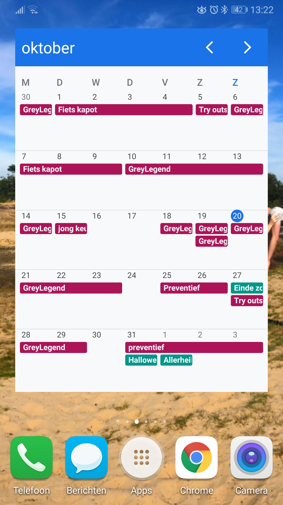
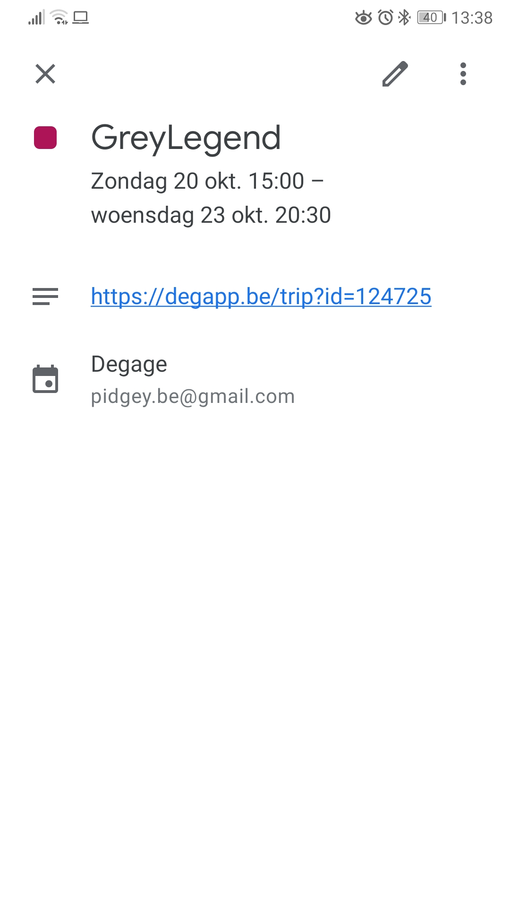
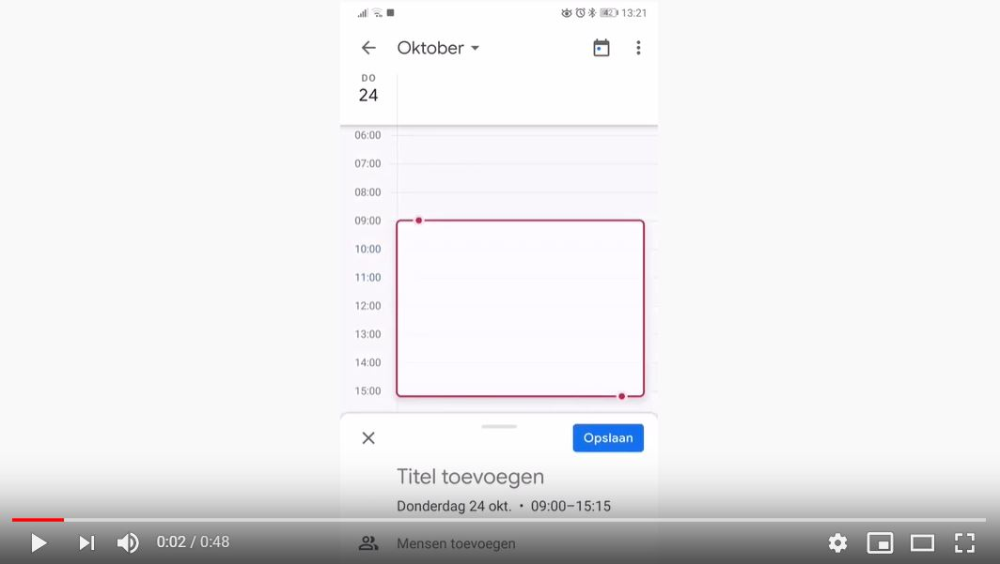

# Dégage Google Calendar Sync
Syncing between Dégage and Google Calendar.

https://www.degage.be/autodelen/

I've set up this project to get automated syncing between Dégage car sharing and Google Calendar. This makes the usage of Dégage a lot more convenient for me: If I have an appointment where I need my car, I simply create the event in my "Dégage"-calendar on Google Calendar. If I don't need a car, I put it in my regular calendar. The project syncs my Dégage calendar with the Dégage website so all other users can see when my car is available and when not.

Current functionality:
* Create an event in Google Calendar when a new trip appears in Dégage.
* + if the new event is a request from another user, it will get a `[REQ]` prefix in Google
* + When the request gets accepted/rejected, the Google Calendar event gets updated accordingly
* If you create an event in Google Calendar, it will automatically create a new trip in Dégage.
* If you delete the event in Google Calendar, the trip in Dégage will be deleted too.
* Trips created via Dégage can only be deleted via Dégage. Trips created via Google Calendar, can only be deleted via Google Calendar.

The project is written in Python and is ran by a cronjob on a Raspberry Pi.

## Demo
For reservations made by others, a calendar event is created with the name of the car (in my case GreyLegend) and a hyperlink to the Dégage website.
The reservations you make yourself can have a custom name.


[](https://www.youtube.com/watch?v=rwK-EHoO47E)


## Use

To make use of it, you'll first need to:
1. Create a Dégage agenda in Google Calendar and put your calendar_id in [config.json](config.json)
2. Follow the steps described [here](https://medium.com/@denisluiz/python-with-google-sheets-service-account-step-by-step-8f74c26ed28e) to set up a Google Developers project and create a service account key. But instead of adding `Google Sheets API`, add `Google Calendar API`. Also share your Dégage Google calendar with your service account email, as described for Google Sheets. After this point you can stop following that tutorial.
3. Save the service account json file as `service_account.json` into your main folder.
4. Put your Dégage email, password and car id in [config.json](config.json)
5. If you have multiple accounts/cars/..., you can add multiple entries in [config.json](config.json)
6. run `python sync.py`

*Alternatively, if you are prepared to share your Dégage login with me, I can set up the automatic syncing for you. In this case you'll also have to share your Dégage Google Calendar with me so I can access both your Dégage account and your Calendar (only the Dégage one!).*

On linux, add a crontab line to automate syncing e.g. every 5 minutes:

`crontab -e`
```
*/5 * * * * /usr/local/bin/python3.6 PATH_TO_sync.py
```
(make sure to install all requirements via `pip3 install -r requirements.txt`)
